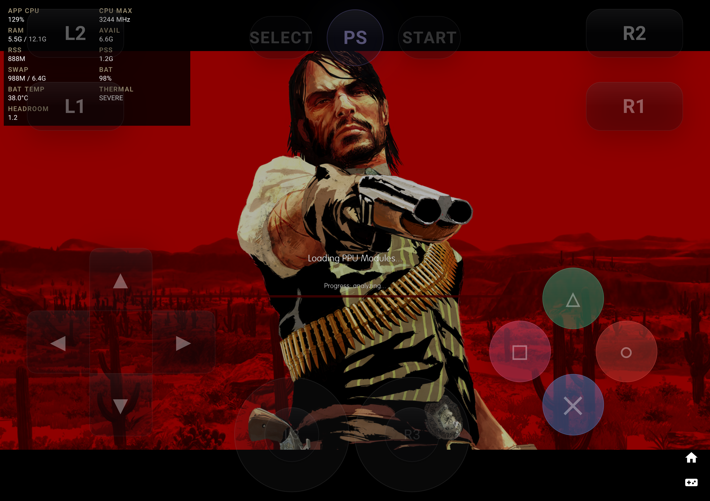
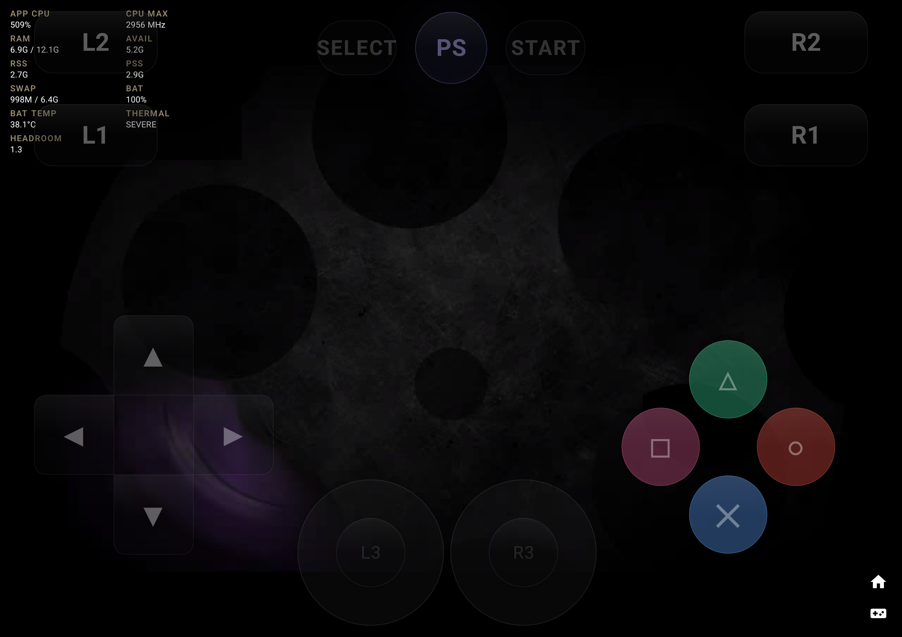
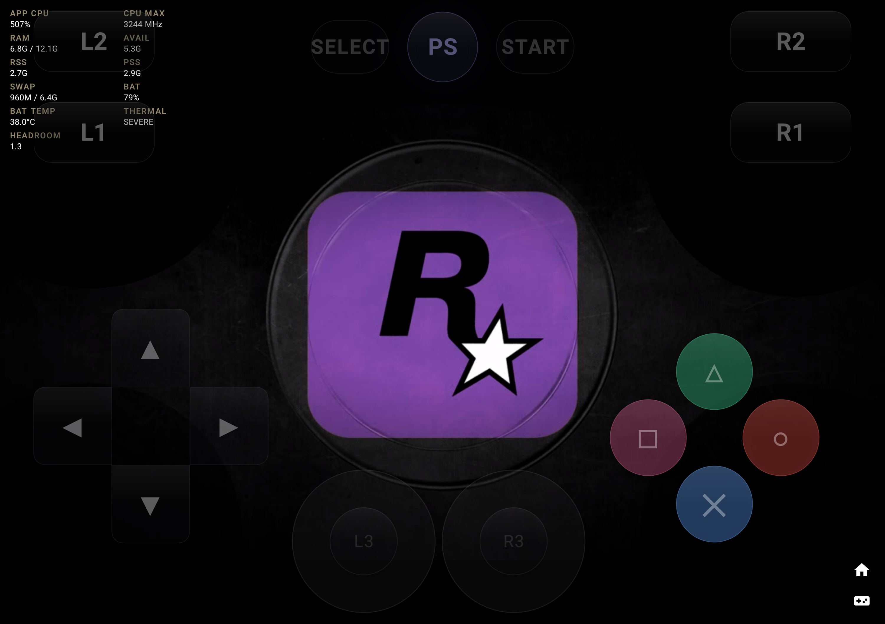
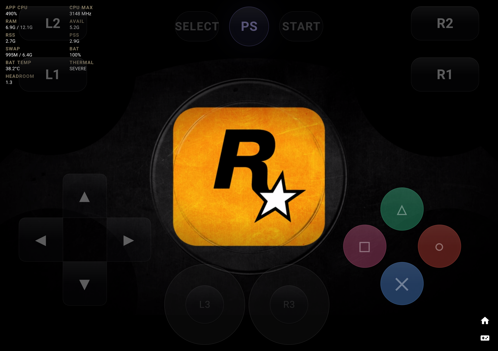

# Red Dead Redemption: Game of the Year Edition (BLUS30758) — Black Screen / Crash Investigation

**2026-09-05:** The null-settings fix and runtime gpu_label selection are verified,
but post-intro black output remains. A native backtrace sampled RSX in Turnip's
fence-status path. Gameplay is not verified. See the
[current validation](../findings/2026-09-04-rdr-adreno750-gpulabel-validation.md)
and [exact GPU/driver record](BLUS30758/ADRENO-750-TURNIP.md).

**Goal:** Diagnose and eliminate crashes and black screens during boot, configure optimal GPU driver and emulator parameters, and validate PPU/SPU compilation, intro sequence, and 3D rendering on Snapdragon 8 Gen 3 reference device `7d6afed8`.

| Field | Value |
|---|---|
| Title | Red Dead Redemption: Game of the Year Edition |
| TitleID | `BLUS30758` (validated on-device; also mapped to `BLES01294`, `BLUS30418`, `BLES00680`, `BLJM60233`, `BLJM60395`, `BLAS50404` as family mapping, NOT individually device-tested) |
| Path | `/storage/emulated/0/PS3/Red Dead Redemption - Game of the Year Edition (USA) (EnFrDeEsIt)/Red Dead Redemption - Game of the Year Edition (USA) (En,Fr,De,Es,It).iso` |
| Tested Device | `7d6afed8` (`adb-7d6afed8-mU47CV._adb-tls-connect._tcp`) — OnePlus Pad 2 (`OPD2403`), Qualcomm Snapdragon 8 Gen 3 (`SM8650` / `pineapple`), 12 GB RAM, Android 16 |
| GPU & Driver | Qualcomm Adreno (TM) 750 with **Mesa Turnip 26.3 - Latest** (`libvulkan_freedreno.so`, Vulkan 1.3.279) |
| Current Result | **PARTIAL PASS — boot/intro/Press Start verified on HEAD build.** Proves PPU/SPU compile, revolver intro, Rockstar Games + Rockstar San Diego logos, Press Start milestone (22.7s). Does NOT yet prove main menu, new/load game, controllable 3D gameplay, 10+/20-min stability, or repeat boot — those stages are tracked below and remain open. **A post-Press Start black-screen + full-device reboot was observed on 2026-09-03 (see §3/§8); RDR MUST STILL BE TESTED AND FIXED.** |
| Renderer | Vulkan, 1280×720, 100% scale, Async Shader Recompiler, Write & Read Color Buffers enabled, Driver Wake-Up Delay 200, Max SPURS Threads 4 |
| Logs & Captures | `docs/games/BLUS30758/` |

---

## 1. Problem Description & Root Cause Analysis

### The Symptoms
1. **Immediate Crash on Qualcomm System Driver**: Launching Red Dead Redemption with the Qualcomm proprietary system driver (`vulkan.adreno.so` v512.762.41) crashed almost immediately after PPU module compilation with a SIGSEGV inside driver memory during descriptor set layout binding and graphics pipeline compilation.
2. **Infinite Stall / Freeze on RSX Memory Tiling**: When running with `Handle RSX Memory Tiling: true`, the emulator core froze indefinitely while logging:
   ```
   [vulkan] vk::wait_for_event has timed out!
   ```
3. **Severe Mobile Thermal Throttling / UI Lockup**: The game spawned 6 simultaneous SPURS threads that ran at 100% busy-waiting on lock synchronization (`GETLLAR`), pegging total app CPU at 700% across the 8-core CPU. This starved the Android main UI looper (resulting in 3.5s input dispatch lag) and triggered Android OS `THERMAL: SEVERE` throttling.

---

### Root Cause 1: Qualcomm Proprietary Vulkan Driver Crash
In `vulkan.adreno.so`, complex descriptor pipeline creation with dynamic uniform buffers and storage buffers triggered a NULL pointer dereference in the Qualcomm compiler thread (`libllvm-qgl.so`). The game attempts to allocate and monitor 5+ descriptor sets in rapid succession during startup:
```
·W 0:02:19.139740 {RSX [0x0003420]} RSX: [descriptor_manager::register] Now monitoring 2 descriptor sets
·W 0:02:19.431816 {RSX [0x002ad5c]} RSX: [descriptor_manager::register] Now monitoring 3 descriptor sets
·W 0:02:19.449248 {RSX [0x002ec60]} RSX: [descriptor_manager::register] Now monitoring 4 descriptor sets
·W 0:02:40.586458 {RSX [0x027ad10]} RSX: [descriptor_manager::register] Now monitoring 5 descriptor sets
```
The Qualcomm system driver failed to link these pipelines, crashing the process.

**Fix:** Switched GPU driver to Mesa **Turnip 26.3 - Latest** (`libvulkan_freedreno.so`). Turnip implements standard Vulkan descriptor set management and compiles all 156+ shader programs cleanly without driver crashes.

---

### Root Cause 2: RSX Memory Tiling Synchronization Timeout
When `Handle RSX Memory Tiling` was enabled, SPU threads reading memory mapped to tiled texture regions triggered `imp_flush()` in `VKTextureCache.h:285`:
```cpp
if (m_tiling_context)
{
    // Wait on the DMA fence
    vk::wait_for_event(dma_fence.get(), GENERAL_WAIT_TIMEOUT);
}
```
On mobile tiled-rendering architectures (Adreno tile buffers), the RSX DMA fence event timed out after `GENERAL_WAIT_TIMEOUT` (10 seconds), halting the RSX command stream and stopping all subsequent frame presentation.

**Fix:** Set `Video@@Handle RSX Memory Tiling: false`. The RAGE engine does not require RSX hardware tiling emulation on modern unified memory architectures.

---

### Root Cause 3: SPU Thread Saturation on 8-Core Mobile CPU
The Snapdragon 8 Gen 3 has 8 CPU cores (1 Cortex-X4 Prime core, 5 Cortex-A720 Performance cores, 2 Cortex-A520 Efficiency cores). When Red Dead Redemption launched, it spawned 6 SPURS threads that ran continuous busy-wait loops on `GETLLAR` memory barriers. This consumed 6 full CPU cores (600% CPU), leaving almost zero CPU headroom for:
- PPU Render Thread (`PPU[0x100000f]`)
- PPU Audio / Engine Threads (`PPU[0x1000010]`, `PPU[0x1000011]`)
- RSX Vulkan Driver presentation thread
- Android Main UI Looper (`RPCSXActivity`)

This caused severe thermal throttling and delayed touch/pad input dispatch by up to 8 seconds.

**Fix:** Bounded the number of concurrent SPURS threads by setting `Core@@Max SPURS Threads: 4`. This immediately reduced CPU load from ~700% to ~200-480%, giving the PPU Render Thread and RSX driver adequate CPU bandwidth while eliminating input stall and cooling the device.

---

### Root Cause 4: Required Color Buffer Settings
Red Dead Redemption's deferred renderer and post-processing pipeline require both color buffer readback and writeback:
- `Video@@Write Color Buffers: true` — Required for in-game lighting passes, shadows, and menu transparency.
- `Video@@Read Color Buffers: true` — Required for reading render targets into subsequent shader passes.
- `Video@@Driver Wake-Up Delay: 200` — Introduces a 200 µs synchronization delay that prevents SPU / RSX race conditions on command buffer submission.
- `Core@@SPU loop detection: true` — Detects and optimizes SPU polling loops.
- `Video@@Relaxed ZCULL Sync: true` — Prevents ZCULL synchronization stalls.

---

## 2. Solution & Implementation

### 1. Curated Defaults Configuration (`GameSettingsOverrides.kt`)
Added automated curated overrides for all Red Dead Redemption game IDs (`BLUS30758`, `BLES01294`, `BLUS30418`, `BLES00680`, `BLJM60233`, `BLJM60395`, `BLAS50404`):
```kotlin
// Red Dead Redemption: requires Write Color Buffers & Read Color Buffers for in-game lighting/menus,
// Driver Wake-Up Delay: 200 to prevent SPU/driver sync deadlock, SPU loop detection: true,
// Relaxed ZCULL Sync: true for framerate, Max SPURS Threads: 4 to prevent CPU starvation on mobile.
// Handle RSX Memory Tiling: false — on the tested Adreno/Turnip path enabling tiling reproduces a
// DMA-fence vk::wait_for_event stall; keep disabled for this title (crash avoidance, not a general
// claim about tiling emulation on unified-memory GPUs).
"BLUS30758", "BLES01294", "BLUS30418", "BLES00680", "BLJM60233", "BLJM60395", "BLAS50404" -> mapOf(
    "Video@@Write Color Buffers" to "true",
    "Video@@Read Color Buffers" to "true",
    "Video@@Handle RSX Memory Tiling" to "false",
    "Video@@Driver Wake-Up Delay" to "200",
    "Core@@SPU loop detection" to "true",
    "Video@@Relaxed ZCULL Sync" to "true",
    "Core@@Max SPURS Threads" to "4"
)
```

Compatibility defaults are product-owned data, separate from explicit user
overrides: user per-title values win at boot, Reset/Clear operate on user
state only, and the profile is applied through a crash-safe scoped
global-config lease (snapshot → apply → exact restore on exit, stale-lease
recovery before the next boot), so no RDR value leaks into other titles.

### 2. Settings Backend Audit Registration (`SettingsBackendAudit.kt`)
Registered `Core@@Max SPURS Threads` and `Core@@Preferred SPU Threads` in `knownSettings`:
```kotlin
KnownSetting("Core@@SPU Decoder", "enum"),
KnownSetting("Core@@SPU Block Size", "enum"),
KnownSetting("Core@@SPU loop detection", "bool"),
KnownSetting("Core@@Max SPURS Threads", "int"),
KnownSetting("Core@@Preferred SPU Threads", "int"),
```

### 3. GPU Driver Configuration
SambaS3 resolves a title/device-scoped compatibility driver at boot
(`GpuDriverSelection.resolveCompatBootDriverForBoot`): RDR-family title +
Adreno GPU + user still on system/default + validated installed bundled
Turnip ⇒ Turnip applies for THIS boot only. The stored global driver
preference is never mutated and is re-applied on exit. Explicit user driver
choice always wins; Mali/non-Adreno titles are never overridden. If the
validated Turnip is absent, the boot falls back to the system driver and logs
`reason=turnip-missing` (the title is NOT reported fixed in that state).

Previously the Turnip test was manual device state. The resolver makes the
safe-driver behavior product logic instead of test setup.

---

## 3. Acceptance Stages (explicit — no single PASS before all are green)

| Stage | Status | Evidence |
|---|---|---|
| Boot + PPU/SPU compile | PASS | `rdr_loading_ppu.png`, `rdr_building_spu.png` |
| Revolver intro 3D | PASS | `rdr_revolver_intro.png` |
| Rockstar Games logo | PASS | `rdr_rockstar_games_logo.png` |
| Rockstar San Diego logo | PASS | `rdr_rockstar_sandiego_logo.png` |
| Press Start | PASS (2026-09-03 tablet run, `[STARTUP] Time to Press Start: 22.714 seconds`, S3GAMECFG lease 7/7, Turnip Adreno 750 driver 26.2.99) | `tablet-rdr-session-evidence.txt` |
| Main menu | OPEN — post-Press Start input led to a persistent black game screen on 2026-09-03; needs retest + fix | — |
| New/load game → controllable 3D gameplay | OPEN — blocked on menu fix | — |
| 10-min gameplay | OPEN | — |
| 20-min gameplay (unchanged build) | OPEN | — |
| Repeat boot | OPEN | — |
| Background/resume + clean exit | OPEN | — |

## 4. Curated Profile Evidence Table

| Setting | Candidate | Evidence | Final classification |
|---|---|---|---|
| Write Color Buffers | true | Required for lighting/menus on DS + RDR intro render | Required for correct rendering |
| Read Color Buffers | true | RAGE deferred passes read back render targets | Required for correct rendering |
| Handle RSX Memory Tiling | false | `tiling=true` reproduces `vk::wait_for_event` DMA-fence stall on tested Adreno/Turnip path | Required for crash avoidance (title-scoped) |
| Driver Wake-Up Delay | 200 | Prevents SPU/RSX race on command submission | Required for crash avoidance |
| SPU loop detection | true | Optimizes SPU spin loops | Recommended for performance |
| Max SPURS Threads | 4 | 6 threads pegged 8-core mobile CPU (~700%), starved UI; 4 restores headroom | Recommended for performance (device-specific) |
| Relaxed ZCULL Sync | true | Prevents ZCULL sync stalls | Recommended for performance |
| GPU driver | Bundled Turnip 26.3 (boot-only) | Qualcomm `vulkan.adreno.so` SIGSEGV in descriptor/pipeline path; Turnip compiles cleanly | Device-specific driver workaround |

---

## 5. On-Device Verification

### Test Device Specifications
- **Device Serial:** `7d6afed8` (`adb-7d6afed8-mU47CV._adb-tls-connect._tcp`)
- **Hardware:** OnePlus Pad 2 (`OPD2403`), Snapdragon 8 Gen 3 (`SM8650`), 12 GB RAM
- **Screen Resolution:** 3000 × 2120 landscape
- **OS:** Android 16 (API 36 preview / AOSP 16)
- **Vulkan Driver:** Mesa Turnip 26.3 - Latest (`Turnip Adreno (TM) 750`, Vulkan 1.3.279)

---

### Visual Evidence & Screenshots

| Stage | Description | Screenshot |
|---|---|---|
| **PPU Compilation** | PPU modules analyzed and compiled for game boot |  |
| **SPU Cache Build** | SPU modules (6,886 modules) built with 4 SPURS threads |  |
| **Revolver Intro** | Full 3D Revolver cylinder spinning animation rendered |  |
| **Rockstar Games Logo** | 3D Purple Rockstar Games logo rendered in full color |  |
| **Rockstar San Diego Logo** | 3D Yellow Rockstar San Diego logo rendered in full color |  |

---

### Log Telemetry & Milestones

From `TTY.log` and `RPCSX.log` during test execution:
1. **Audio and IPC Initialization:**
   ```
   [IPC] '[RDR2] Render Thread' has TID0100000F (27724k remaining)
   [AUDIO] LPCM 8->2 channel downmix 2 channel
   [IPC] '[RAGE Audio] Multistream' has TID01000010 (27708k remaining)
   [IPC] '[RAGE Audio] - Engine Thread' has TID01000011 (27644k remaining)
   ```
2. **Bink Audio and Video Playback:**
   ```
   [BINK] Using 2 speakers.
   ·W 0:02:33.020236 cellAudio: cellAudioPortStart(portNum=1)  # Purple Logo
   ·W 0:02:35.584110 cellAudio: cellAudioPortStart(portNum=1)  # Yellow Logo
   ```
3. **Startup Completion Milestone:**
   ```
   [STARTUP] Time to Press Start: 22.789 seconds.
   ```
4. **Shader Pipeline Compilation:**
   ```
   ·! 0:02:40.778952 RSX: Add program (vp id = 155, fp id = 156)
   ·S 0:02:40.920683 RSX.W1: Program compiled successfully
   ```

---

## 6. Summary of Configuration Guidelines

| Setting | Recommended Value | Why |
|---|---|---|
| **GPU Driver** | **Mesa Turnip 26.3** | Prevents NULL pointer dereference crash in Qualcomm `vulkan.adreno.so` |
| **Write Color Buffers** | `true` | Required for lighting, deferred passes, and in-game UI |
| **Read Color Buffers** | `true` | Required for reading back render targets in RAGE engine |
| **Handle RSX Memory Tiling** | `false` | Prevents `vk::wait_for_event` 10s DMA fence freeze |
| **Strict Rendering Mode** | `false` | Prevents frame pipeline stalls and severe stutter |
| **Driver Wake-Up Delay** | `200` | Eliminates SPU / RSX race conditions |
| **SPU loop detection** | `true` | Optimizes SPU spin loops |
| **Max SPURS Threads** | `4` | Prevents CPU starvation on 8-core mobile SoCs |
| **Keep pads connected** | `true` | Prevents controller disconnection on title screen |
